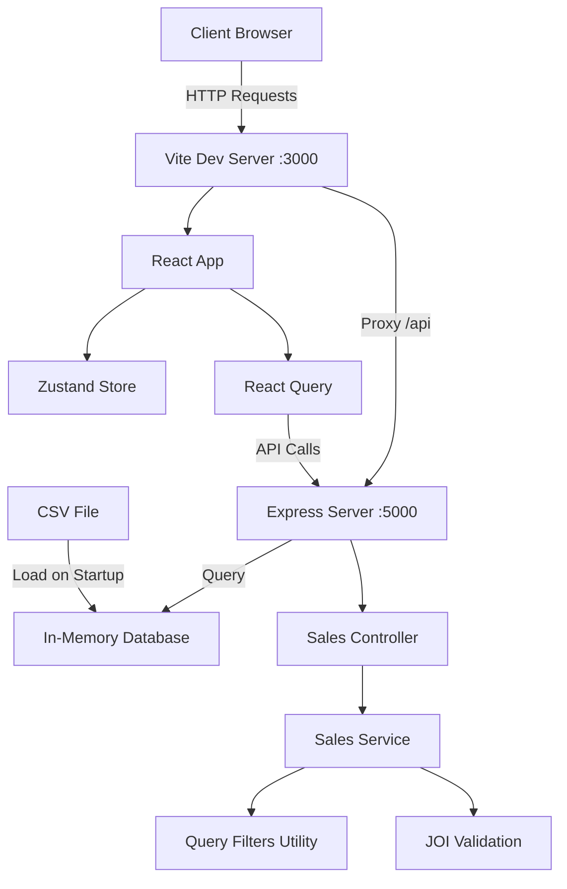

# System Architecture - TruEstate Sales Management

This document describes the technical architecture of the TruEstate Sales Management System.

## System Overview



## Architecture Layers

### Backend Architecture

#### 1. **Entry Point** (`src/index.js`)
- Initializes Express server
- Loads middleware (CORS, JSON parsing)
- Registers routes
- Loads CSV data on startup
- Error handling

#### 2. **Routes Layer** (`src/routes/`)
- Defines API endpoints
- Maps URLs to controller functions
- Handles HTTP methods

**Endpoints:**
- `GET /api/sales` - Main sales data endpoint
- `GET /api/sales/filter-options` - Filter dropdown options

#### 3. **Controller Layer** (`src/controllers/`)
- Handles HTTP request/response
- Validates query parameters using JOI
- Calls service layer
- Returns formatted responses
- Error handling

**Responsibilities:**
- Request validation
- Response formatting
- HTTP status codes
- Error messages

#### 4. **Service Layer** (`src/services/`)
- Contains business logic
- Orchestrates data operations
- Calculates insights (totals, aggregations)
- Calls utilities for filtering/sorting/pagination

**Key Functions:**
- `getSalesData(filters)` - Main query function
- `calculateInsights(data)` - Aggregation calculations
- `getFilterOptions()` - Unique value extraction

#### 5. **Utilities** (`src/utils/`)

**`queryFilters.js`** - Core filtering logic:
- `applyQueryFilters(data, filters)` - Single function for ALL filtering
  - Search (customer name, phone)
  - Region filter
  - Gender filter
  - Age range
  - Category filter
  - Tags filter
  - Payment method filter
  - Date range
- `applySorting(data, sortBy)` - Sorting implementation
- `applyPagination(data, page, pageSize)` - Pagination logic

**`validation.js`** - JOI schemas:
- Query parameter validation
- Type checking
- Range validation
- Custom validators for age/date ranges

**`dataLoader.js`** - CSV ingestion:
- Reads CSV file
- Parses and transforms data
- Normalizes field names
- Type conversion (strings to numbers/dates)
- Populates in-memory database

#### 6. **Models** (`src/models/`)

**`database.js`** - In-memory data store:
- Stores sales data array
- Caches unique values for filters
- Provides data access methods
- Singleton pattern

---

### Frontend Architecture

#### Component Hierarchy

```
App
├── AppHeader
├── SearchBar
├── FilterBar
│   ├── MultiSelectDropdown (x5)
│   └── SortDropdown
├── InsightsCards
├── DataTable
└── Pagination
```

#### State Management

**Zustand Store** (`stores/filterStore.js`):
- Manages all filter state
- Actions for updating filters
- Automatic reset to page 1 on filter change
- Clear all filters action

**State Shape:**
```javascript
{
  search: '',
  regions: [],
  gender: '',
  ageMin: null,
  ageMax: null,
  categories: [],
  tags: [],
  payment: [],
  dateFrom: null,
  dateTo: null,
  sort: 'date',
  page: 1
}
```

#### Data Fetching

**React Query** (`hooks/useSalesData.js`):
- Fetches sales data from API
- Query key includes all filter state
- Automatic refetch when filters change
- 30-second stale time
- Keep previous data during refetch

**Flow:**
1. User changes filter in UI
2. Zustand store updates
3. React Query detects state change
4. Auto-triggers new API call
5. UI shows loading state
6. Data updates with new results

#### Component Responsibilities

**AppHeader**
- Displays app logo and title
- Sticky positioned at top

**SearchBar**
- Text input with search icon
- 300ms debounce
- Clear button
- Updates Zustand store

**FilterBar**
- Container for all filters
- Loads filter options from API
- Renders MultiSelectDropdown for each filter
- SortDropdown on right side

**MultiSelectDropdown**
- Reusable component
- Checkbox list
- Pill badge showing count
- Click outside to close

**SortDropdown**
- Three sort options
- Shows current selection
- Updates sort in store

**InsightsCards**
- Three cards: Units, Amount, Discount
- Receives insights from API response
- Updates based on filtered data
- Icons and color coding

**DataTable**
- Renders table with headers
- Maps data to rows
- Responsive horizontal scroll
- Hover effects

**Pagination**
- Page numbers with ellipsis
- Previous/Next buttons
- Disabled states
- Updates page in store

**TableSkeleton**
- Loading placeholder
- Shimmer animation
- Matches table structure

**EmptyState**
- Shows when no results
- Icon and message
- Suggests trying different filters

---

## Data Flow

### Request Flow (Filtering Example)

1. **User Action**
   - User selects "East" in Region filter

2. **State Update**
   - `FilterBar` calls `setRegions(['East'])`
   - Zustand updates `regions` state and resets `page` to 1

3. **Query Trigger**
   - React Query detects state change
   - Calls `fetchSalesData(filters)`

4. **API Request**
   - `salesService.js` builds query params
   - Axios GET request: `/api/sales?regions=East&page=1&sort=date`

5. **Backend Processing**
   - Express routes to `sales.controller.js`
   - Controller validates params with JOI
   - Calls `getSalesData({ regions: ['East'], page: 1, sort: 'date' })`

6. **Service Layer**
   - `sales.service.js` gets all data from database
   - Parses comma-separated filters
   - Calls `applyQueryFilters(data, { regions: ['East'] })`

7. **Filtering**
   - `queryFilters.js` filters data where `customer_region === 'East'`
   - Returns filtered array

8. **Sorting & Pagination**
   - `applySorting(filtered, 'date')` sorts by date descending
   - `applyPagination(sorted, 1, 10)` returns first 10 items
   - `calculateInsights(filtered)` computes totals

9. **Response**
   ```json
   {
     "success": true,
     "data": [...10 items...],
     "meta": { "totalItems": 45, "totalPages": 5, "currentPage": 1, "pageSize": 10 },
     "insights": { "totalUnits": 152, "totalAmount": 89000, "totalDiscount": 5400 }
   }
   ```

10. **Frontend Update**
    - React Query caches response
    - `App.jsx` receives new data
    - `InsightsCards` updates with new insights
    - `DataTable` renders new rows
    - `Pagination` shows new page count

---

## Module Responsibilities

### Backend Modules

| Module | Responsibility | Key Exports |
|--------|---------------|-------------|
| `index.js` | Server initialization | - |
| `routes/sales.routes.js` | API routing | Router |
| `controllers/sales.controller.js` | Request handling | `getAllSales`, `getFilters` |
| `services/sales.service.js` | Business logic | `getSalesData`, `calculateInsights`, `getFilterOptions` |
| `utils/queryFilters.js` | Filtering logic | `applyQueryFilters`, `applySorting`, `applyPagination` |
| `utils/validation.js` | Input validation | `validateQuery`, `salesQuerySchema` |
| `utils/dataLoader.js` | CSV loading | `loadSalesData` |
| `models/database.js` | Data storage | `db` singleton |

### Frontend Modules

| Module | Responsibility | Key Exports |
|--------|---------------|-------------|
| `App.jsx` | Main component | `App` |
| `stores/filterStore.js` | Global state | `useFilterStore` hook |
| `services/salesService.js` | API calls | `fetchSalesData`, `fetchFilterOptions` |
| `hooks/useSalesData.js` | Data fetching | `useSalesData` hook |
| `hooks/useFilterOptions.js` | Filter options | `useFilterOptions` hook |
| `hooks/useDebounce.js` | Debounce utility | `useDebounce` hook |
| `components/**` | UI components | Various components |

---

## API Contract

### Request Schema

```
GET /api/sales
```

**Query Parameters:**

| Parameter | Type | Required | Description |
|-----------|------|----------|-------------|
| search | string | No | Search term for name/phone |
| regions | string | No | Comma-separated regions |
| gender | string | No | 'Male' or 'Female' |
| ageMin | number | No | Minimum age (0-150) |
| ageMax | number | No | Maximum age (0-150) |
| categories | string | No | Comma-separated categories |
| tags | string | No | Comma-separated tags |
| payment | string | No | Comma-separated payment methods |
| dateFrom | string | No | ISO date (YYYY-MM-DD) |
| dateTo | string | No | ISO date (YYYY-MM-DD) |
| sort | string | No | 'date', 'quantity', or 'customerName' |
| page | number | No | Page number (default: 1) |

### Response Schema

```json
{
  "success": true,
  "data": [
    {
      "transaction_id": "TXN-001",
      "date": "2023-09-26",
      "customer_id": "CUST12016",
      "customer_name": "Neha Yadav",
      "phone_number": "+91 9123456789",
      "gender": "Female",
      "age": 25,
      "customer_region": "East",
      "customer_type": "Returning",
      "product_id": "PROD-847",
      "product_name": "Herbal Face Skin",
      "product_brand": "Skin&Glow",
      "product_category": "Beauty",
      "tags": "organic,skincare",
      "quantity": 5,
      "price_per_unit": 4268,
      "discount": 12,
      "total_amount": 21340,
      "payment_method": "UPI",
      "store": "ST-015",
      "delivery_type": "Standard",
      "store_rating": 187.92
    }
  ],
  "meta": {
    "totalItems": 20,
    "totalPages": 2,
    "currentPage": 1,
    "pageSize": 10
  },
  "insights": {
    "totalUnits": 64,
    "totalAmount": 187420.32,
    "totalDiscount": 542.5
  }
}
```

---

## Performance Considerations

1. **In-Memory Database**: Fast reads, no disk I/O
2. **Query Memoization**: React Query caches results for 30 seconds
3. **Debounced Search**: Reduces API calls from 300ms delay
4. **Efficient Filtering**: Single-pass filtering with early returns
5. **Pagination**: Only sends 10 items per response
6. **Keep Previous Data**: Smooth transitions during refetch

---

## Error Handling

### Backend
- JOI validation errors → 400 Bad Request
- Server errors → 500 Internal Server Error
- Detailed error messages in response
- Console logging for debugging

### Frontend
- React Query error states
- Error boundary for component errors
- User-friendly error messages
- Retry logic for failed requests

---

## Future Enhancements

1. **Database**: Add PostgreSQL or MongoDB for production
2. **Authentication**: User login and role-based access
3. **Export**: CSV/Excel export functionality
4. **Charts**: Visualizations for analytics
5. **Real-time**: WebSocket updates for live data
6. **Advanced Filters**: Date ranges with calendar picker
7. **Bulk Actions**: Multi-row selection and operations

---

**Last Updated:** December 2024
